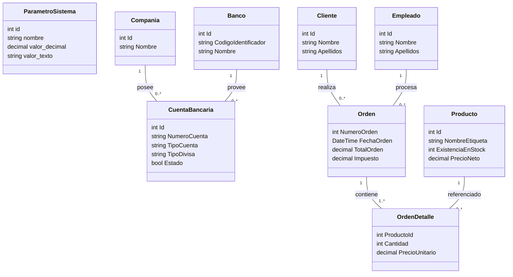

# Diagrama de dominio (Mermaid classDiagram)

```mermaid
classDiagram
	class ParametroSistema {
		int id
		string nombre
		decimal valor_decimal
		string valor_texto
	}

	class Banco {
		int Id
		string CodigoIdentificador
		string Nombre
	}

	class Compania {
		int Id
		string Nombre
	}

	class CuentaBancaria {
		int Id
		string NumeroCuenta
		string TipoCuenta
		string TipoDivisa
		bool Estado
	}

	class Cliente {
		int Id
		string Nombre
		string Apellidos
	}

	class Empleado {
		int Id
		string Nombre
		string Apellidos
	}

	class Producto {
		int Id
		string NombreEtiqueta
		int ExistenciaEnStock
		decimal PrecioNeto
	}

	class Orden {
		int NumeroOrden
		DateTime FechaOrden
		decimal TotalOrden
		decimal Impuesto
	}

	class OrdenDetalle {
		int ProductoId
		int Cantidad
		decimal PrecioUnitario
	}

	%% Relaciones (multiplicidades)
	Compania "1" -- "0..*" CuentaBancaria : posee
	Banco "1" -- "0..*" CuentaBancaria : provee
	Cliente "1" -- "0..*" Orden : realiza
	Empleado "1" -- "0..*" Orden : procesa
	Orden "1" -- "1..*" OrdenDetalle : contiene
	Producto "1" -- "0..*" OrdenDetalle : referenciado

```
