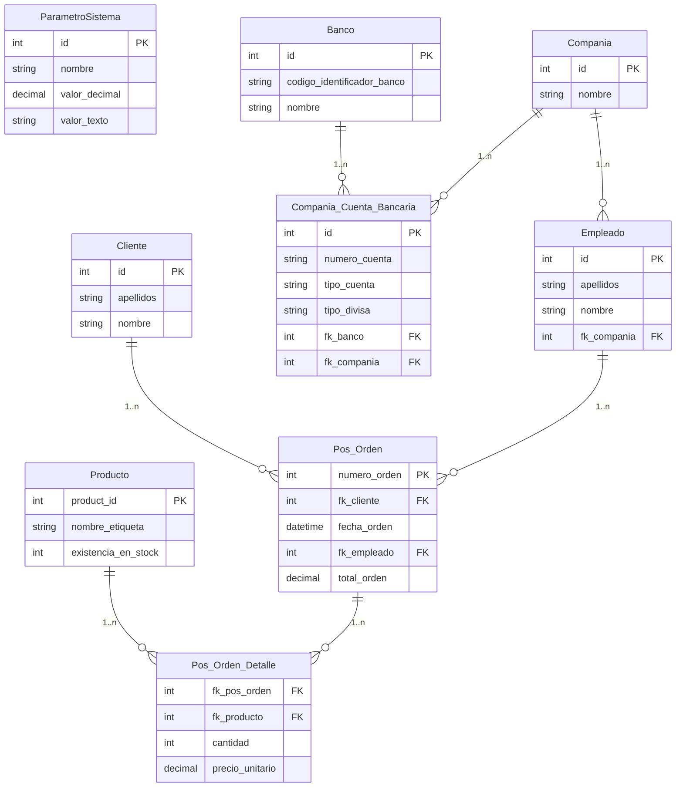

# Diagrama ER (Mermaid) - basado en Proyecto_backend/database/00_create_salespro.sql

```mermaid
erDiagram
	ParametroSistema {
		int id PK
		string nombre
		decimal valor_decimal
		string valor_texto
	}

	Banco {
		int id PK
		string codigo_identificador_banco
		string nombre
	}

	Compania {
		int id PK
		string nombre
	}

	Cliente {
		int id PK
		string apellidos
		string nombre
	}

	Empleado {
		int id PK
		string apellidos
		string nombre
		int fk_compania FK
	}

	Producto {
		int product_id PK
		string nombre_etiqueta
		int existencia_en_stock
	}

	Compania_Cuenta_Bancaria {
		int id PK
		string numero_cuenta
		string tipo_cuenta
		string tipo_divisa
		int fk_banco FK
		int fk_compania FK
	}

	Pos_Orden {
		int numero_orden PK
		int fk_cliente FK
		datetime fecha_orden
		int fk_empleado FK
		decimal total_orden
	}

	Pos_Orden_Detalle {
		int fk_pos_orden FK
		int fk_producto FK
		int cantidad
		decimal precio_unitario
	}

	Banco ||--o{ Compania_Cuenta_Bancaria : "1..n"
	Compania ||--o{ Compania_Cuenta_Bancaria : "1..n"
	Compania ||--o{ Empleado : "1..n"
	Cliente ||--o{ Pos_Orden : "1..n"
	Empleado ||--o{ Pos_Orden : "1..n"
	Pos_Orden ||--o{ Pos_Orden_Detalle : "1..n"
	Producto ||--o{ Pos_Orden_Detalle : "1..n"

	%% Notas:
	%% - Compania_Cuenta_Bancaria representa cuentas de compañía (tabla Compania_Cuenta_Bancaria)
	%% - Los checks y constraints (p.ej. divisas permitidas) están definidos en el script SQL
```
