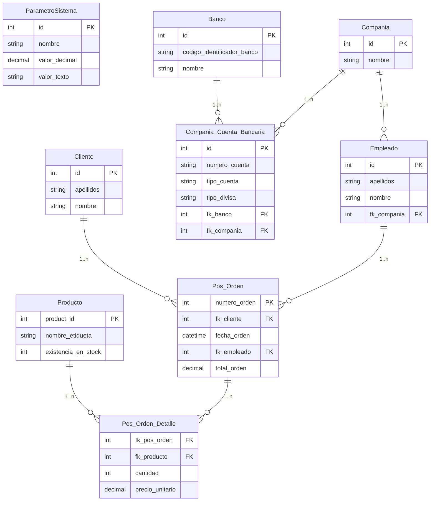
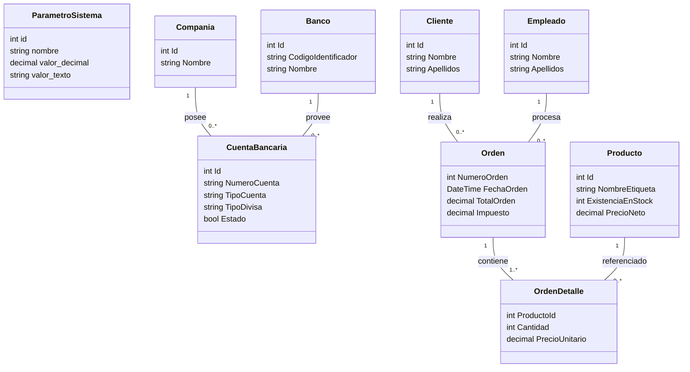

# Informe Final del Proyecto 2 - Equipo 5

**Curso:** Lenguajes para Aplicaciones Comerciales (LPAC)

**Equipo:** 5

**Integrantes:**

| Nombre | GitHub |
|---|---|
| Caleb Hernández Vega | `@CalebHv21` |
| Sebastian Cordero | `@cbastiancq-lab` |
| Josue Delgado Corrales | `@JosueDelgadoCorrales` |
| Alejandro Porras | `@axpew` |

**Fecha:** 2026-07-01

---

## Tabla de contenidos

1. Introducción y objetivo
2. Especificación de la necesidad
3. Arquitectura y diseño
4. API REST (tabla de endpoints)
5. Modelo entidad-relación
6. Modelo de dominio
7. Funcionalidades implementadas
8. Manejo transaccional y evidencia
9. Pruebas y resultados
10. Accesibilidad
11. Conclusiones
12. Bitácora
13. Referencias

---

## 1. Introducción y objetivos

El sistema SalesPro es una aplicación comercial orientada a la gestión de cuentas bancarias de compañía y al registro de órdenes de venta. El Equipo 5 tiene asignado el módulo de **CRUD de cuentas bancarias**, integrado como parte de un sistema mayor que también incluye el registro de órdenes de venta con patrón maestro-detalle.

**Objetivo general:** Desarrollar una aplicación de escritorio con backend REST y base de datos relacional que implemente la gestión de cuentas bancarias y el registro de órdenes de venta aplicando arquitectura por capas.

**Objetivos específicos:**

- Implementar un CRUD completo para cuentas bancarias de compañía con validaciones de negocio.
- Implementar el registro de órdenes de venta con manejo transaccional en la capa de datos.
- Proveer una interfaz de usuario WPF bajo el patrón MVVM que consuma la API REST.
- Aplicar principios básicos de accesibilidad digital en la interfaz WPF.
- Documentar la API con OpenAPI/Swagger para facilitar pruebas y revisión.

---

## 2. Especificación de la necesidad

**Requisitos funcionales implementados:**

| Código | Requisito |
|---|---|
| RF-01 | Listar cuentas bancarias con filtro de búsqueda |
| RF-02 | Crear cuenta bancaria con validación de moneda, banco y compañía |
| RF-03 | Actualizar cuenta bancaria existente |
| RF-04 | Eliminar cuenta bancaria |
| RF-05 | Seleccionar cliente desde la interfaz de orden |
| RF-06 | Buscar productos y agregarlos a la orden |
| RF-07 | Indicar cantidad por producto en la orden |
| RF-08 | Remover productos de la orden |
| RF-09 | Incrementar y decrementar cantidades en la orden |
| RF-10 | Mostrar subtotal, impuesto (IVA) y total de la orden |
| RF-11 | Actualizar inventario al procesar una orden |
| RF-12 | Ejecutar rollback si falla alguna parte de la transacción de orden |

**Requisitos no funcionales:**

- La capa de datos usa `SqlTransaction` para proteger la atomicidad de las órdenes.
- La API documenta sus endpoints con OpenAPI (Swagger) disponible en `/swagger`.
- La interfaz WPF incluye atributos de accesibilidad digital alineados con criterios de la Ley 7600.

---

## 3. Arquitectura y diseño

El proyecto sigue una **arquitectura de tres capas** separada en proyectos .NET independientes:

```
Proyecto_backend/
  SalesPro.Api         Controladores REST (ASP.NET Core Web API)
  SalesPro.Business    Servicios de negocio y validaciones
  SalesPro.Data        Repositorios ADO.NET y SqlTransaction
  SalesPro.Domain      Entidades y excepciones del dominio
  SalesPro.Contracts   DTOs, requests y responses (capa compartida)
  database/            Script SQL Server (00_create_salespro.sql)
  scripts/             Utilidades de preparación local (LocalDB)
Proyecto_WPF/
  SalesPro.Wpf         Interfaz de usuario WPF (MVVM manual)
```

**Flujo de datos:**

```
WPF (MVVM) → HTTP → SalesPro.Api → SalesPro.Business → SalesPro.Data → SQL Server
```

- El **WPF** se comunica con la API mediante `HttpClient`.
- La **API** valida las solicitudes entrantes y delega a la capa de negocio.
- El **Business** aplica reglas de dominio (unicidad, existencia, stock) antes de llegar a datos.
- El **Data** ejecuta SQL con ADO.NET y envuelve operaciones críticas en `SqlTransaction`.

---

## 4. API REST (tabla de endpoints)

URL base local: `http://localhost:5294`

Documentación interactiva: `http://localhost:5294/swagger`

### Catálogos

| Ruta | Verbo | Descripción | Parámetros | Respuestas |
|---|---|---|---|---|
| `/api/catalogos/bancos` | GET | Lista todos los bancos disponibles | — | 200 OK |
| `/api/catalogos/companias` | GET | Lista las compañías registradas | — | 200 OK |
| `/api/catalogos/clientes` | GET | Busca clientes por nombre o apellido | `buscar` (query, opcional) | 200 OK |
| `/api/catalogos/productos` | GET | Busca productos por nombre de etiqueta | `buscar` (query, opcional) | 200 OK |

### Cuentas bancarias

| Ruta | Verbo | Descripción | Parámetros | Respuestas |
|---|---|---|---|---|
| `/api/cuentas-bancarias` | GET | Lista cuentas bancarias con filtro opcional | `buscar` (query, opcional) | 200 OK |
| `/api/cuentas-bancarias/{id}` | GET | Obtiene una cuenta por ID | `id` (path, int) | 200 OK, 404 Not Found |
| `/api/cuentas-bancarias` | POST | Crea una nueva cuenta bancaria | Body: `CrearCuentaBancariaRequest` | 201 Created, 400 Bad Request, 409 Conflict |
| `/api/cuentas-bancarias/{id}` | PUT | Actualiza una cuenta bancaria existente | `id` (path, int), Body: `ActualizarCuentaBancariaRequest` | 200 OK, 400 Bad Request, 404 Not Found, 409 Conflict |
| `/api/cuentas-bancarias/{id}` | DELETE | Elimina una cuenta bancaria | `id` (path, int) | 204 No Content, 404 Not Found |

**Condiciones de error:**
- `400 Bad Request`: tipo de divisa no permitido (solo se aceptan divisas registradas en `ParametroSistema`).
- `404 Not Found`: cuenta con el ID solicitado no existe.
- `409 Conflict`: ya existe una cuenta con el mismo número de cuenta en el mismo banco.

### Órdenes

| Ruta | Verbo | Descripción | Parámetros | Respuestas |
|---|---|---|---|---|
| `/api/ordenes/{numeroOrden}` | GET | Obtiene una orden por número | `numeroOrden` (path, int) | 200 OK, 404 Not Found |
| `/api/ordenes` | POST | Crea una orden de venta con transacción | Body: `CrearOrdenRequest` | 201 Created, 400 Bad Request, 404 Not Found, 409 Conflict |

**Condiciones de error (órdenes):**
- `400 Bad Request`: lista de detalles vacía, cantidad ≤ 0, o productos repetidos en el detalle.
- `404 Not Found`: cliente o producto no existe o no está activo.
- `409 Conflict`: stock insuficiente para uno o más productos, o producto no habilitado para venta.

---

## 5. Modelo entidad-relación

El modelo relacional implementado en SQL Server se describe en el diagrama siguiente.



**Relaciones principales:**

- Una **compañía** puede tener múltiples **cuentas bancarias**, cada una asociada a un banco específico.
- Una **orden** pertenece a un cliente y fue procesada por un empleado. Tiene uno o más detalles.
- Cada **detalle de orden** referencia un producto y registra la cantidad y precio unitario al momento de la venta.
- `ParametroSistema` almacena el IVA y las divisas válidas como configuración del sistema.

---

## 6. Modelo de dominio

Las clases del dominio representan las entidades del sistema independientemente de la capa de persistencia.



---

## 7. Funcionalidades implementadas

- **CRUD de cuentas bancarias:** creación, listado con búsqueda, obtención por ID, actualización y eliminación desde la API y desde la interfaz WPF.
- **Catálogos:** endpoints de solo lectura para bancos, compañías, clientes y productos, usados por el WPF para poblar formularios y buscadores.
- **Orden de venta maestro-detalle:** selección de cliente, búsqueda y adición de productos, ajuste de cantidades, cálculo automático de subtotal, IVA y total, y procesamiento con descuento de inventario.
- **Transacción en backend:** la orden de venta usa `SqlTransaction` en la capa `SalesPro.Data`. Si falla cualquier operación (cliente inválido, stock insuficiente, error de inserción), se ejecuta rollback y la base de datos no queda en estado parcial.
- **Swagger / OpenAPI:** documentación interactiva disponible en `/swagger` durante desarrollo.
- **Accesibilidad digital:** las vistas WPF incluyen nombres accesibles (`AutomationProperties.Name`), ayudas de controles (`ToolTip`), orden de tabulación (`TabIndex`) y mensajes de estado, compatibles con lectores de pantalla y navegación por teclado (criterios asociados a la Ley 7600).

---

## 8. Manejo transaccional y evidencia

La creación de una orden de venta involucra múltiples operaciones de escritura en la base de datos:

1. Inserción del encabezado en `Pos_Orden`.
2. Para cada producto en el detalle:
   - Verificación de stock disponible.
   - Inserción de la línea en `Pos_Orden_Detalle`.
   - Descuento del stock en `Producto`.

Todas estas operaciones se ejecutan dentro de un único `SqlTransaction`. Si cualquier paso falla (por ejemplo, stock insuficiente en el segundo producto), se hace rollback completo: ni la orden ni ningún detalle ni descuento de inventario quedan persistidos.

La evidencia real de las pruebas (consultas SQL antes y después, respuestas HTTP) se documenta en:

```text
docs/EVIDENCIA_TRANSACCIONES.md
docs/EVIDENCIA_ORDEN_WPF.md
docs/EVIDENCIA_CRUD_CUENTAS.md
```

---

## 9. Pruebas y resultados

Las pruebas se realizaron mediante el archivo `.http` incluido en el proyecto:

```text
Proyecto_backend/SalesPro.Api/SalesPro.Api.http
```

**Casos cubiertos:**

| Recurso | Caso | Resultado esperado |
|---|---|---|
| Catálogos | Listar bancos, compañías, clientes, productos | 200 OK con lista |
| Cuentas bancarias | Crear cuenta válida | 201 Created |
| Cuentas bancarias | Crear con moneda inválida | 400 Bad Request |
| Cuentas bancarias | Crear duplicada (mismo número y banco) | 409 Conflict |
| Cuentas bancarias | Obtener por ID existente | 200 OK |
| Cuentas bancarias | Obtener por ID inexistente | 404 Not Found |
| Cuentas bancarias | Actualizar cuenta existente | 200 OK |
| Cuentas bancarias | Actualizar ID inexistente | 404 Not Found |
| Cuentas bancarias | Actualizar con número duplicado | 409 Conflict |
| Cuentas bancarias | Actualizar con moneda inválida | 400 Bad Request |
| Cuentas bancarias | Eliminar cuenta existente | 204 No Content |
| Cuentas bancarias | Eliminar ID inexistente | 404 Not Found |
| Órdenes | Crear orden válida con IVA e inventario | 201 Created |
| Órdenes | Crear con detalles vacíos | 400 Bad Request |
| Órdenes | Crear con productos repetidos en detalle | 400 Bad Request |
| Órdenes | Crear con cantidad ≤ 0 | 400 Bad Request |
| Órdenes | Crear con cliente inexistente | 404 Not Found |
| Órdenes | Crear con producto inexistente | 404 Not Found |
| Órdenes | Crear con stock insuficiente (rollback) | 409 Conflict |
| Órdenes | Crear con producto no habilitado para venta | 409 Conflict |
| Órdenes | Obtener orden por número | 200 OK |
| Órdenes | Obtener orden inexistente | 404 Not Found |

Los resultados reales de cada prueba se documentan en los archivos de evidencia.

---

## 10. Accesibilidad

La interfaz WPF implementa medidas básicas de accesibilidad digital:

- **Nombres accesibles** (`AutomationProperties.Name`): cada control interactivo tiene un nombre descriptivo que los lectores de pantalla pueden anunciar.
- **Ayudas de controles** (`ToolTip`): los botones y campos importantes tienen una descripción visible al posicionarse sobre ellos.
- **Orden de tabulación** (`TabIndex`): los campos del formulario siguen un orden lógico de izquierda a derecha, de arriba a abajo.
- **Mensajes de estado:** la interfaz muestra retroalimentación textual ante éxitos y errores, sin depender únicamente de color.

Estas medidas se alinean con criterios de accesibilidad asociados a la Ley 7600 de Costa Rica (Igualdad de Oportunidades para las Personas con Discapacidad).

---

## 11. Conclusiones

- La arquitectura por capas permitió que cada integrante trabajara en su módulo de forma independiente, reduciendo conflictos de integración.
- El uso de `SqlTransaction` en la capa de datos garantiza la integridad de las órdenes: no es posible que queden registros parciales ante un fallo.
- El archivo `.http` combinado con Swagger agilizó la verificación de endpoints durante el desarrollo, sin necesidad de herramientas externas.
- La incorporación de accesibilidad desde el diseño inicial del WPF, en lugar de como ajuste posterior, resultó en cambios mínimos y coherentes con la interfaz.
- La separación `SalesPro.Domain` / `SalesPro.Contracts` evitó que los DTOs de la API quedaran acoplados a las entidades internas, facilitando cambios sin romper contratos.

---

## 12. Bitácora

Ver: `docs/BITACORA_TAREAS.md`

---

## 13. Referencias

- Microsoft. (2024). *ASP.NET Core documentation*. https://learn.microsoft.com/aspnet/core
- Microsoft. (2024). *WPF documentation*. https://learn.microsoft.com/dotnet/desktop/wpf
- Microsoft. (2024). *ADO.NET overview*. https://learn.microsoft.com/dotnet/framework/data/adonet
- Microsoft. (2024). *SqlTransaction class*. https://learn.microsoft.com/dotnet/api/system.data.sqlclient.sqltransaction
- Fowler, M. (2002). *Patterns of enterprise application architecture*. Addison-Wesley.
- Asamblea Legislativa de Costa Rica. (1996). *Ley 7600: Igualdad de Oportunidades para las Personas con Discapacidad*.

---

## Anexos

- Script de base de datos: `Proyecto_backend/database/00_create_salespro.sql`
- Archivo de pruebas HTTP: `Proyecto_backend/SalesPro.Api/SalesPro.Api.http`
- Evidencias: `docs/EVIDENCIA_TRANSACCIONES.md`, `docs/EVIDENCIA_CRUD_CUENTAS.md`, `docs/EVIDENCIA_ORDEN_WPF.md`

Para convertir a DOCX o PDF:

```powershell
pandoc docs/informe/Informe_Final_Proyecto2_Equipo5.md -o docs/informe/Informe_Final_Proyecto2_Equipo5.docx
pandoc docs/informe/Informe_Final_Proyecto2_Equipo5.md -o docs/informe/Informe_Final_Proyecto2_Equipo5.pdf
```
# Desarrollo de una aplicación web para gestión de punto de venta

Equipo 5  
Lenguajes para Aplicaciones Comerciales  
Proyecto 2  
Fecha de entrega: 2 de julio de 2026

## Integrantes

| Integrante | GitHub |
|---|---|
| Caleb Hernández Vega | `CalebHv21` |
| Sebastián Cordero | `cbastiancq-lab` |
| Josué Delgado Corrales | `JosueDelgadoCorrales` |
| Alejandro Porras | `axpew` |

## Trazabilidad Git y aportes verificables

La revisión del historial Git muestra aportes técnicos verificables principalmente de Sebastián Cordero y Josué Delgado Corrales. En este informe no se atribuyen tareas no comprobadas a otros integrantes; sus nombres se mantienen como parte del equipo, pero la bitácora técnica se basa en commits, ramas y PRs disponibles en el repositorio.

| Persona | Evidencia Git | Aporte verificable |
|---|---|---|
| Sebastián Cordero | `feature/sebas-db-transacciones`, PRs de integración, commits de estructura, evidencia y entrega | Base de datos, configuración SQL Server, transacciones, estructura de entrega, pruebas finales, documentación y coordinación del repositorio. |
| Josué Delgado Corrales | `feature/josue-api-business`, PR #6, commits `9b56631` y `6c55371` | Ajustes y documentación técnica de API/Business, respuestas HTTP de controladores y apoyo en endpoints relacionados con cuentas, catálogos y órdenes. |
| Caleb Hernández Vega | Sin evidencia técnica independiente registrada en el cierre revisado | Rol asignado a documentación/pruebas, pendiente de evidencia específica en bitácora si corresponde. |
| Alejandro Porras | Sin evidencia técnica independiente registrada en el cierre revisado | Rol asignado a WPF, pendiente de evidencia específica en bitácora si corresponde. |

Esta decisión evita inflar la documentación con aportes no verificados y facilita una defensa honesta del trabajo realizado.

## Resumen

El proyecto implementa una aplicación de punto de venta con backend en ASP.NET Core Web API y frontend en WPF. El backend expone servicios RESTful, aplica una arquitectura por capas y utiliza ADO.NET contra SQL Server. El frontend consume la API mediante ViewModels y permite ejecutar las dos funcionalidades solicitadas: el CRUD asignado al Equipo 5, correspondiente a cuentas bancarias, y el registro de una orden de venta con estructura maestro-detalle.

El registro de órdenes contempla selección de cliente, búsqueda de productos, cantidades, subtotal, impuesto, total e impacto sobre inventario. La persistencia de la orden se ejecuta dentro de una transacción SQL para evitar inconsistencias si ocurre un error durante la operación.

Estado de evidencia: se anexó evidencia real de API, CRUD de cuentas bancarias y transacciones contra SQL Server del curso. Quedan pendientes las capturas manuales de WPF para respaldar visualmente la interfaz.

## Objetivos

### Objetivo general

Desarrollar una aplicación de punto de venta con backend RESTful en ASP.NET Core Web API, frontend WPF y persistencia en SQL Server, cumpliendo los requerimientos funcionales asignados al Equipo 5.

### Objetivos específicos

- Implementar el CRUD de cuentas bancarias.
- Implementar una orden de venta maestro-detalle.
- Consumir la API REST desde WPF.
- Aplicar una arquitectura por capas: API, negocio, datos y dominio.
- Utilizar ADO.NET y transacciones SQL donde corresponda.
- Incorporar medidas básicas de accesibilidad en la interfaz WPF, conforme a los principios de acceso a la información indicados en la Ley N.° 7600 y criterios técnicos WCAG.
- Documentar endpoints, modelo entidad-relación, modelo de dominio, pruebas y bitácora.

## Especificación de la necesidad

El sistema permite administrar cuentas bancarias de compañía y registrar órdenes de venta. La orden debe asociarse a un cliente, contener productos con cantidades, calcular importes, procesarse contra la base de datos y actualizar inventario.

El sistema se divide en:

- Backend: expone API RESTful y ejecuta reglas de negocio.
- Capa de datos: consulta y modifica SQL Server mediante ADO.NET.
- WPF: consume la API y muestra las interfaces de cuentas bancarias y nueva orden.

## Arquitectura

| Capa | Proyecto | Responsabilidad |
|---|---|---|
| API | `SalesPro.Api` | Controladores REST, Swagger, configuración y manejo de errores. |
| Negocio | `SalesPro.Business` | Validaciones y reglas de negocio. |
| Datos | `SalesPro.Data` | Repositorios ADO.NET, consultas SQL y transacciones. |
| Dominio | `SalesPro.Domain` | Entidades base y excepciones del dominio. |
| Contratos | `SalesPro.Contracts` | DTOs, requests y responses compartidos con WPF. |
| Frontend | `SalesPro.Wpf` | Vistas WPF, ViewModels y consumo de API. |

## API RESTful desarrollada

| Recurso | URL | Método | Descripción | Respuestas principales |
|---|---|---:|---|---|
| Estado API | `/` | GET | Verifica que la API responde. | 200 |
| Bancos | `/api/catalogos/bancos` | GET | Lista bancos disponibles. | 200 |
| Compañías | `/api/catalogos/companias` | GET | Lista compañías disponibles. | 200 |
| Clientes | `/api/catalogos/clientes?buscar={texto}` | GET | Busca clientes activos. | 200 |
| Productos | `/api/catalogos/productos?buscar={texto}` | GET | Busca productos disponibles. | 200 |
| Cuentas bancarias | `/api/cuentas-bancarias` | GET | Lista o filtra cuentas bancarias. | 200 |
| Cuentas bancarias | `/api/cuentas-bancarias/{id}` | GET | Obtiene una cuenta por id. | 200, 404 |
| Cuentas bancarias | `/api/cuentas-bancarias` | POST | Crea una cuenta bancaria. | 201, 400, 409 |
| Cuentas bancarias | `/api/cuentas-bancarias/{id}` | PUT | Actualiza una cuenta bancaria. | 200, 400, 404, 409 |
| Cuentas bancarias | `/api/cuentas-bancarias/{id}` | DELETE | Elimina una cuenta bancaria. | 204, 404 |
| Órdenes | `/api/ordenes` | POST | Crea una orden de venta. | 201, 400, 404, 409 |
| Órdenes | `/api/ordenes/{numeroOrden}` | GET | Obtiene una orden por número. | 200, 404 |

El archivo de pruebas HTTP se encuentra en:

```text
Proyecto_backend/SalesPro.Api/SalesPro.Api.http
```

## Modelo entidad-relación

El modelo entidad-relación se documenta en:

```text
docs/diagramas/ER.md
```

Entidades principales:

- `Banco`
- `Compania`
- `Cliente`
- `Empleado`
- `Producto`
- `Compania_Cuenta_Bancaria`
- `Pos_Orden`
- `Pos_Orden_Detalle`
- `ParametroSistema`

## Modelo de dominio

El modelo de dominio se documenta en:

```text
docs/diagramas/DOMINIO.md
```

El diseño separa contratos de transporte, entidades del dominio, reglas de negocio y acceso a datos.

## Funcionalidades implementadas

### CRUD de cuentas bancarias

La funcionalidad permite:

- listar cuentas;
- buscar cuentas;
- crear cuenta bancaria;
- editar cuenta bancaria;
- eliminar cuenta bancaria;
- validar banco y compañía existentes;
- validar tipos de cuenta y divisa;
- evitar duplicados por banco y número de cuenta.

### Registro de orden

La funcionalidad permite:

- seleccionar cliente;
- buscar producto;
- agregar productos con cantidad;
- incrementar y decrementar cantidades;
- remover productos;
- visualizar subtotal, IVA estimado y total estimado;
- procesar la orden en backend;
- actualizar inventario al procesar.

## Manejo transaccional

La creación de órdenes se implementa en `SalesPro.Data.Repositories.OrdenRepository`. El flujo abre una conexión SQL, inicia una transacción con `BeginTransaction`, valida cliente, empleado y productos, calcula montos, inserta encabezado, descuenta inventario e inserta detalles.

Si ocurre una excepción antes del `Commit`, se ejecuta `Rollback`. Además, la lectura de productos para venta usa bloqueo con `UPDLOCK` y `ROWLOCK`, lo que ayuda a evitar inconsistencias durante el descuento de inventario.

La evidencia se anexó en:

```text
docs/EVIDENCIA_TRANSACCIONES.md
```

## Pruebas

| Área | Archivo de evidencia | Estado |
|---|---|---|
| API REST | `Proyecto_backend/SalesPro.Api/SalesPro.Api.http` | Preparado y ejecutado parcialmente mediante pruebas API |
| Transacciones | `docs/EVIDENCIA_TRANSACCIONES.md` | Evidencia real anexada |
| CRUD cuentas | `docs/EVIDENCIA_CRUD_CUENTAS.md` | Evidencia API anexada; capturas WPF pendientes |
| Orden | `docs/EVIDENCIA_ORDEN_WPF.md` | Evidencia API/transacción anexada; capturas WPF pendientes |

## Accesibilidad, Ley N.° 7600 y criterios WCAG

Aunque el proyecto utiliza WPF como interfaz de escritorio y no corresponde a un sitio web público, se incorporaron medidas básicas de accesibilidad digital para facilitar el uso de la aplicación por teclado y tecnologías de apoyo. Esta decisión se fundamenta en el principio de acceso a la información de la Ley N.° 7600 y en la Directriz N.° 036-MTSS-MICITT, la cual orienta la implementación de accesibilidad digital en sitios y servicios tecnológicos del sector público (Poder Ejecutivo de Costa Rica, 2024).

Además, se tomaron como referencia los principios generales de las Pautas de Accesibilidad para el Contenido Web (WCAG): contenido perceptible, operable, comprensible y robusto (World Wide Web Consortium, 2026). En el contexto del proyecto, estos criterios se aplicaron de forma práctica sobre las vistas WPF solicitadas.

Las medidas incorporadas incluyen:

- nombres accesibles mediante `AutomationProperties.Name`;
- textos de ayuda mediante `AutomationProperties.HelpText`;
- navegación por tabulación mediante `TabIndex` y `KeyboardNavigation.TabNavigation`;
- mensajes de estado con `AutomationProperties.LiveSetting` para notificación a tecnologías de apoyo;
- encabezados identificados con `AutomationProperties.HeadingLevel`;
- controles identificables para acciones principales.

Estas medidas no sustituyen una auditoría formal de accesibilidad ni una validación con lectores de pantalla, pero sí permiten defender que la interfaz fue construida considerando accesibilidad desde el diseño y no como un ajuste posterior.

## Conclusiones

El proyecto cuenta con una estructura funcional alineada con el enunciado: backend RESTful, WPF, SQL Server, CRUD de cuentas bancarias y orden maestro-detalle. La parte transaccional se encuentra implementada en la capa de datos, que es donde corresponde según el diseño por capas.

Para cerrar la entrega, falta anexar las capturas manuales de WPF y exportar este informe a PDF. La evidencia de API, inventario y rollback ya fue registrada contra SQL Server del curso.

## Bitácora

La bitácora se encuentra en:

```text
docs/BITACORA_TAREAS.md
```

## Anexos

- Script SQL: `Proyecto_backend/database/00_create_salespro.sql`
- Pruebas HTTP: `Proyecto_backend/SalesPro.Api/SalesPro.Api.http`
- Diagrama ER: `docs/diagramas/ER.md`
- Modelo dominio: `docs/diagramas/DOMINIO.md`
- Evidencia transacciones: `docs/EVIDENCIA_TRANSACCIONES.md`
- Evidencia CRUD: `docs/EVIDENCIA_CRUD_CUENTAS.md`
- Evidencia orden WPF: `docs/EVIDENCIA_ORDEN_WPF.md`

## Referencias

Microsoft. (s. f.). *ASP.NET Core documentation*. Microsoft Learn.

Microsoft. (s. f.). *Windows Presentation Foundation documentation*. Microsoft Learn.

Microsoft. (s. f.). *SQL Server documentation*. Microsoft Learn.

Poder Ejecutivo de Costa Rica. (2024). *Directriz N.° 036-MTSS-MICITT: Implementación de accesibilidad de la red de los sitios del sector público*. Sistema Costarricense de Información Jurídica. https://pgrweb.go.cr/scij/Busqueda/Normativa/Normas/nrm_texto_completo.aspx?nValor1=1&nValor2=101480&nValor3=139934&param1=NRTC&strTipM=TC

World Wide Web Consortium. (2026). *Sumario de WCAG 2*. Web Accessibility Initiative. https://www.w3.org/WAI/standards-guidelines/wcag/es
